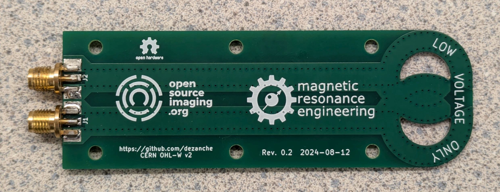
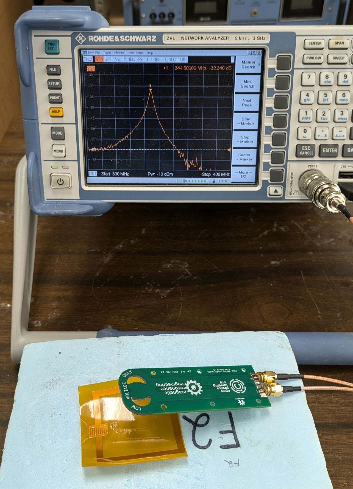
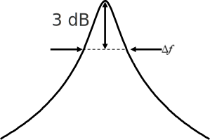
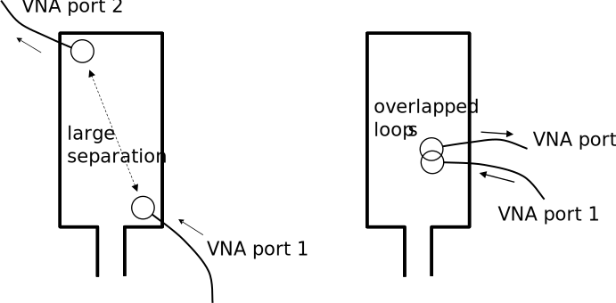
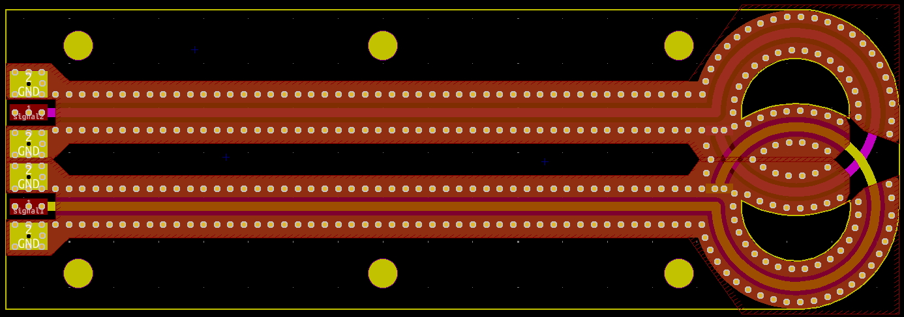
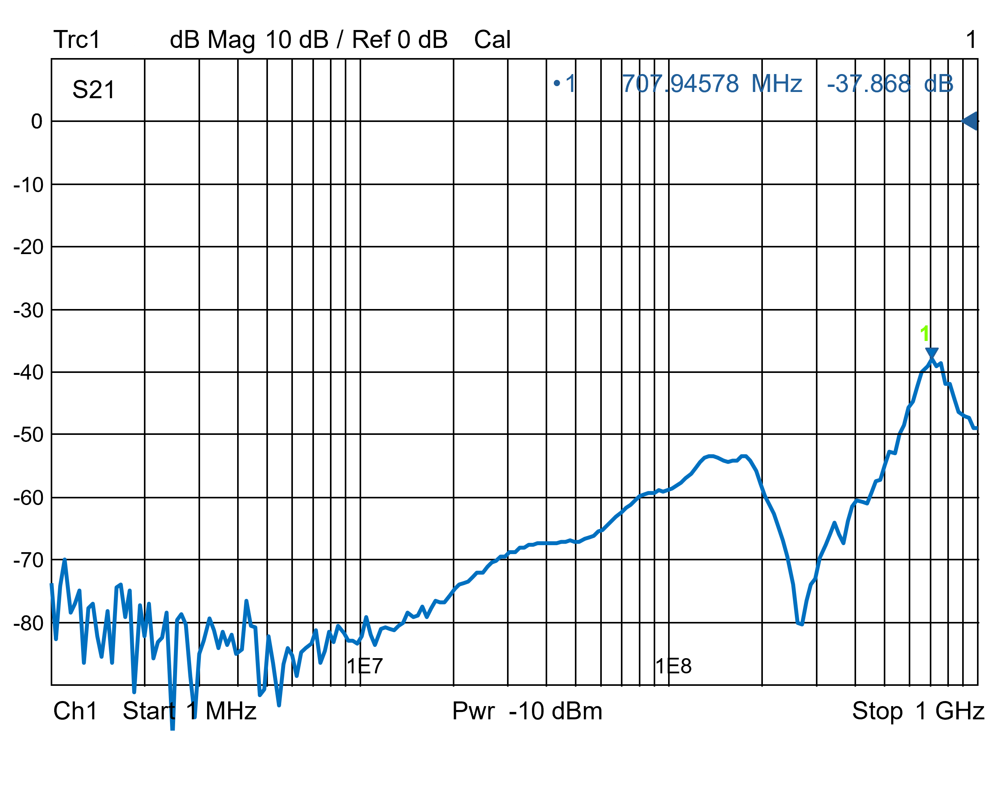

# Decoupled Dual-Loop RF Magnetic Field Probe
 

## MRI and RF Coils
Magnetic resonance imaging (MRI) requires radio frequency (RF) “coils” to excite and receive the MR signal from 1H nuclei (protons). Coils are similar to antennas: they must produce a desired field pattern and operate at a given frequency, which for MR is known as the Larmor frequency and is given by the product of the scanner’s static magnetic field (B0 in tesla – T) and gyromagnetic ratio (γ = 42.58 MHz/T for protons) of the nuclei.

## Measurement of Resonant Frequency and Q

To achieve optimal performance, coils must usually be tuned to the Larmor frequency, e.g., by adjusting one or more capacitors or physical dimensions. Resonant frequency can be measured readily using a vector network analyzer (VNA) and a [single loop probe](https://github.com/dezanche/H-field_RF_probe/) with an S11 measurement (analogous to the dip meter measurement used in the past when VNAs were not cheap and portable). 
The coil’s sensitivity or SNR of the received signal is related to the ratio of loaded and unloaded quality factors (Q) [1]. With some corrections [2], Q can be measured using the same S11 measurement above, but it is challenging because the correction depends on the strength of the coupling which is difficult to control, especially if the probe is positioned manually. It is much more convenient to use two probes and an S21 measurement, in which case the Q is simply f0/∆f, where f0 is the center frequency and ∆f is the FWHM of the resonance curve as shown below.

For this 2-probe measurement it is important that, in absence of the coil being tested, the coupling (or crosstalk) between the two pickup loops be as small as possible (i.e., coupling through the coil should dominate). One way to achieve this is to position the pickup loops at opposite ends of a surface coil as shown below (left). However, this strategy will not work for all coil geometries, e.g., if the coil is small, or to measure the resonance of small accessory circuits like detuning traps.

Following the work of Darrasse and Kassab [3], it has become common to overlap the two pickup loops so that their mutual inductance is zero (right). Arranging the loops orthogonally is also a means of minimizing coupling [4]. It is common to make the pickup loops by hand using semi-rigid, hand-formable or flexible coaxial cable (https://www.uniteng.com/neildocs/references/Probing_the_Magnetic_Field_Probe.htm), but attaching them firmly together in the optimal position is often awkward and unreliable. Recently, a correction strategy was developed to compensate for any remaining coupling [5], but for the correction to work the coupling must remain constant in time.

## Design
The motivation for this work was to make a double-loop probe that is rugged, reliable and provides consistent and sufficiently low intrinsic coupling. The design follows the principles of the single [printed shielded loop probe](https://github.com/dezanche/H-field_RF_probe/), and uses a 4-layer PCB stackup in which the top and bottom layers are ground planes, while the two inner layers contain two stripline loops with appropriate overlap to minimize coupling.

Connections from the board to coaxial cables are made at the end opposite the loops through two side-launch connectors such SMA (compatible with 1.6-mm-thick PCB). The PCB design is provided in both [KiCAD](https://www.kicad.org/) and Gerber format.

## Bill of Materials

| component | source | quantity | unit cost | total cost |
| --------- | ------ | -------- | --------- | ---------- |
| PCB  | various | 1 | 1 USD | 1 USD |
| RF connector | various | 2 | 1 USD | 2 USD |

Total cost of the dual-loop probe with connectors is about 3 USD and varies depending on board manufacturer as well as the type (SMA, QMA, SMB, etc.) and source of the RF connectors.

## Results
The probe was printed using 1.6-mm-thick FR4 material and standard manufacturing tolerances.
The isolation measured between the two ports in absence of other circuits or materials near the probe quantifies its baseline performance. Isolation is better than 50 dB up to 500 MHz, and the worst value up to 1 GHz is 38dB. Some adjustment of isolation is possible by removing small areas of the ground planes at the notch where the two loops cross over each other.

## References
[1]	W. A. Edelstein, G. H. Glover, C. J. Hardy, and R. W. Redington, “The Intrinsic Signal-to-Noise Ratio in NMR Imaging,” Magn Reson Med, vol. 3, no. 4, pp. 604–618, 1986, doi: 10.1002/mrm.1910030413.

[2]	J. R. Ashley and F. M. Palka, “Reflection Coefficient Measurement of Microwave Resonator Q Factors,” The Microwave Journal, pp. 35–39, Jun. 1971.

[3]	Luc Darrasse and Ghazi Kassab, “Quick Measurement of NMR-Coil Sensitivity with a Dual-Loop Probe,” Review of Scientific Instruments, vol. 64, no. 7, pp. 1841–1844, Jul. 1993.

[4]	Axel Haase et al., “NMR Probeheads for In Vivo Applications,” Concepts in Magnetic Resonance, vol. 12, no. 6, pp. 361–388, 2000.

[5]	W. Wang, J. D. Sánchez-Heredia, T. Maurouard, V. Zhurbenko, and J. H. Ardenkjær-Larsen, “Calibrating Double-Loop H-Field Probe Measurements of RF Coil Current for MRI,” IEEE J. Electromagn. RF Microw. Med. Biol., vol. 7, no. 3, pp. 266–272, Sep. 2023, doi: 10.1109/JERM.2023.3274742.

## Contributors
Nicola De Zanche

Giulio Giovannetti

If you use this probe in your work, please cite it as described in the [CITATION](CITATION.cff) file.

## Licenses
Layouts and other CAD files are licensed under the [CERN-OHL-W 2.0 license](https://cern-ohl.web.cern.ch/), version 2.0 or any later version.\
\
All other original content in this repository (including this README file) is licensed under a [Creative Commons Attribution-NoDerivatives 4.0 International License](https://creativecommons.org/licenses/by-nd/4.0/).
